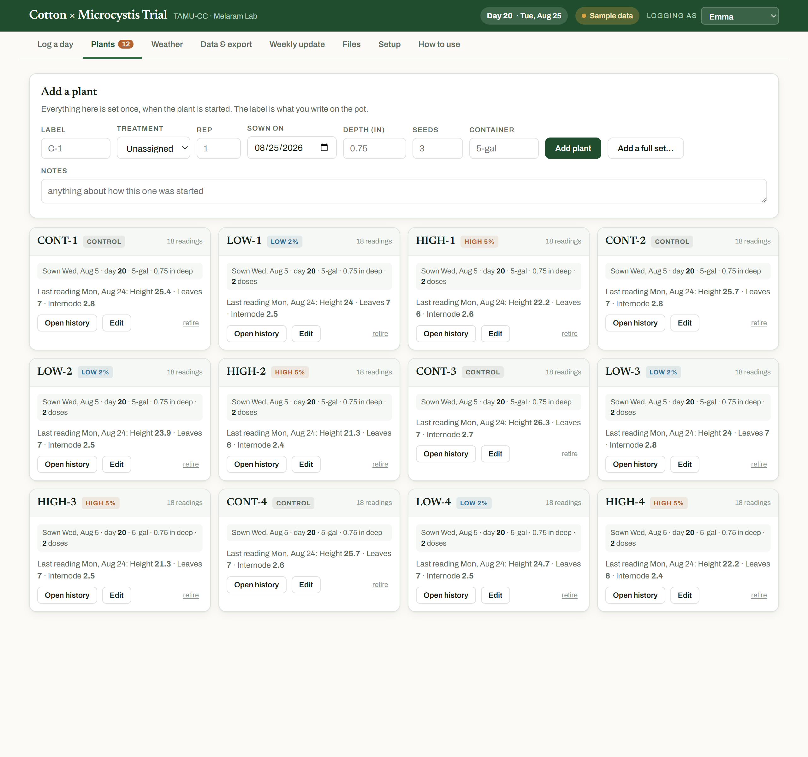
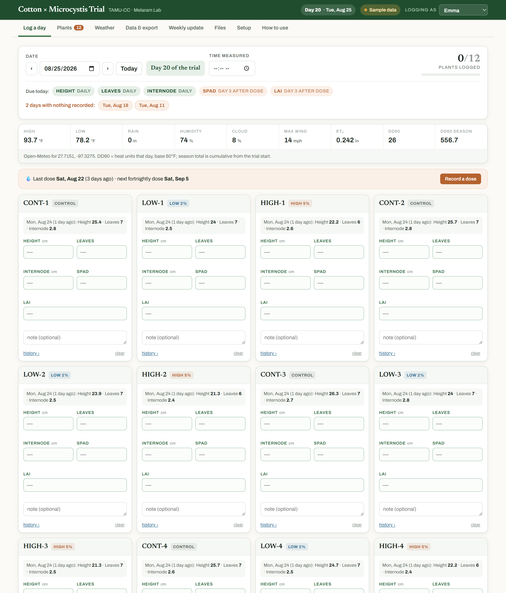
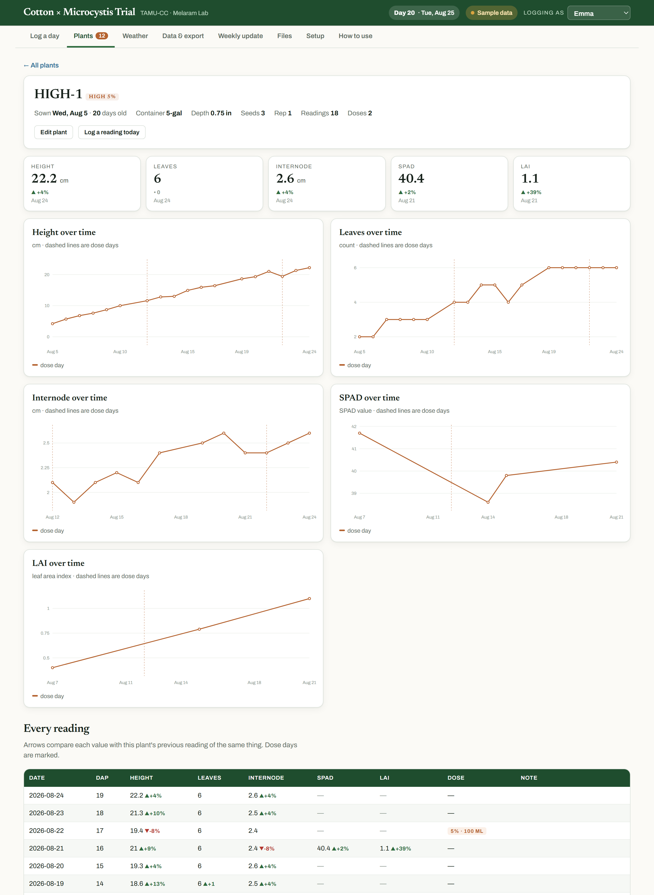
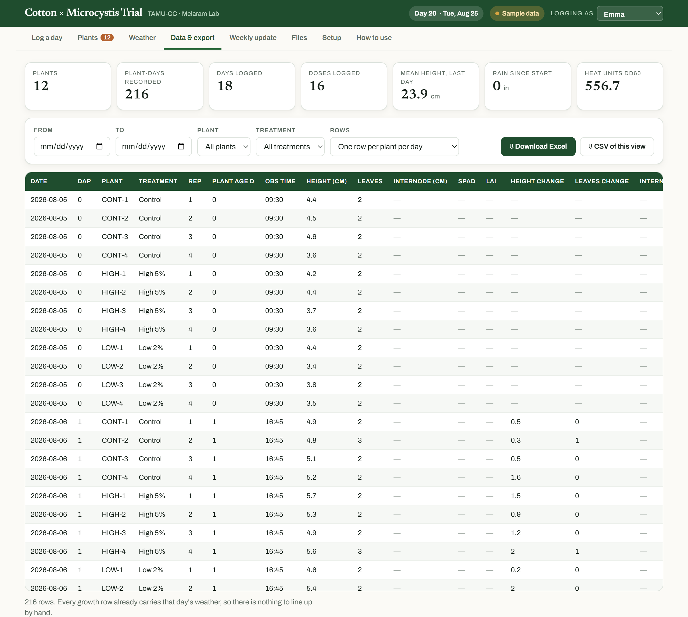
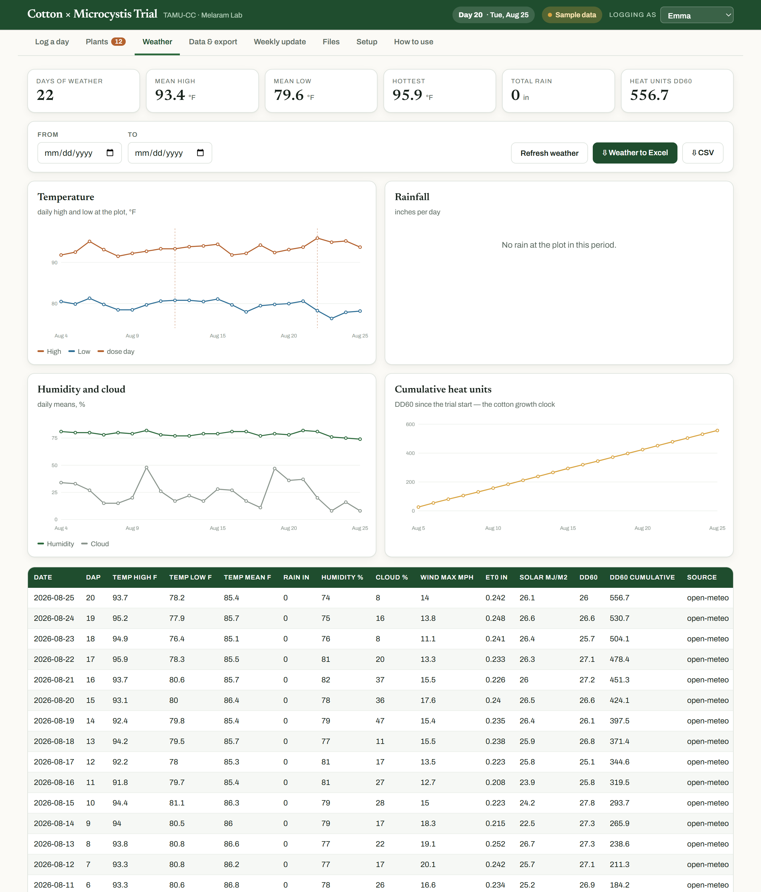
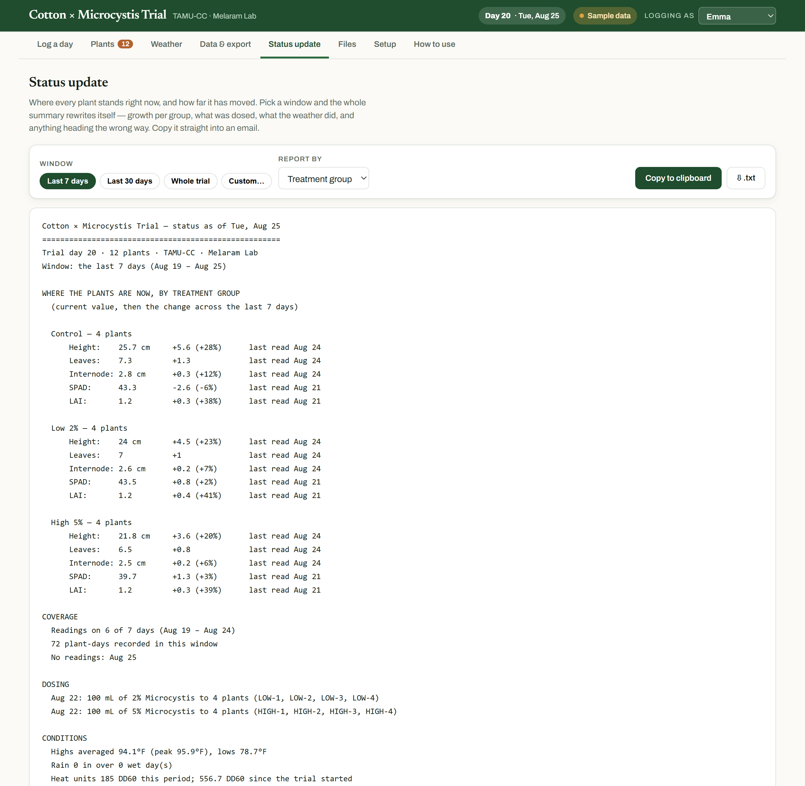

# Cotton Field Log — how to use it

Hi Emma. This replaces the spreadsheet, the R scripts and the macro button. There is
nothing to install and nothing to code. You open a link, type numbers, and the Excel
file is one click away whenever you or a mentor wants it.

**Everything below is shown with the built-in sample trial.** You can load it yourself —
**Setup → Load sample data** — and click around freely. Clearing it puts your real data
back exactly as it was, so there is nothing you can break by exploring.

---

## 1. First time only: add your plants

Go to **Plants**. Add each one with the label you wrote on the pot, its treatment group,
when it was sown, how deep, and how many seeds.

If all twelve start together, fill in the shared details, type a prefix in **Label**, and
press **Add a full set…** — it creates numbered plants split evenly across Control,
Low 2% and High 5%.



You can rename a plant, move it to a different group, or retire it later without losing
a single reading.

---

## 2. Every visit: log the day



Reading the screen from the top:

**The date** is already today. The arrows step back a day at a time if you are filling
something in late — backfilling is completely normal.

**Due today** is the green band. Height, leaves and internode are daily. SPAD is Fridays.
The ceptometer is every other Friday. After a dose, SPAD and LAI come due again three
days later — that band above says `DAY 3 AFTER DOSE` in orange, so you never have to
work it out from a calendar. Boxes that are due are outlined in green.

**Orange chips** list days with nothing recorded at all. Tap one to jump there and fill
it in.

**The weather strip** is filled in for you from the plot's coordinates. DD60 is the heat
units for that day and DD60 SEASON is the running total since the trial started — the
number cotton people actually use instead of calendar days.

**The plant cards.** The grey line on each card is what that plant looked like last time,
so you always know what you are comparing against. Type the numbers. There is no save
button: about a second after you stop typing the card turns green and says ✓ saved.

Two small things that save time:
- Press **Enter** in a box to jump to the same box on the next plant, so you can go
  straight down the bench without touching the mouse.
- If you took something that isn't due today, it's still there under **+ also record**.

**Blank is not zero.** An empty box means you did not measure it. A zero means you
measured and it was zero. The analysis treats those very differently, so please leave
things blank rather than putting in a 0.

**Leaves is a total count** — how many are on the plant right now, not how many are new.
If it goes from 6 to 4 because two dropped, put 4. That fall is exactly the signal this
trial is looking for.

---

## 3. Dosing days

Click **Record a dose** in the orange strip. Pick the date, then the plants — clicking a
group name selects that whole group at once. Controls are left out by default.

Leave **Strength** blank and each plant is dosed at its own group's concentration, and
the box on the right spells out the actual mixture:

```
2% = 2 mL stock + 98 mL water
5% = 5 mL stock + 95 mL water
```

One entry is written per plant, so every plant carries its own exposure history. From
then on, the app knows when the 3-day post-dose SPAD and ceptometer readings are due,
and every chart marks the dose day with a dashed line.

---

## 4. Looking at one plant

Click any plant's name.



You get its latest value for everything with the change since the reading before, a
growth curve for each measurement with the dose days marked, and every reading it has
ever had with green-up / red-down arrows.

This is the screen to open when someone asks "how is the high-dose group doing" — or
when you want to see whether a plant turned the corner after an exposure.

---

## 4b. Fixing a number you already saved

Type over it, or press **clear** on the card to remove a reading entirely.

If that value had already been committed — you saved it on an earlier visit, or someone
else recorded it — a box appears first:

| | |
|---|---|
| **Your initials** | e.g. `ED`. Remembered after the first time |
| **Date of change** | defaults to today |
| **Reason** | tap a common one (transcription error, re-measured, wrong plant, wrong date, instrument error) or type your own |

It shows you exactly what is about to change — `Height 28 → 99.9` — and nothing is saved
until the box is filled in. **Cancel** puts the original value back.

Correcting something you typed a minute ago does **not** ask. That is just finishing your
entry. It only asks once a reading has settled, and once a reading has been formally
corrected it will ask every time after that.

Why it matters: it means every number in your dataset either came straight off the
instrument, or has your initials and a reason next to it explaining why it differs. If a
committee ever asks "why is this point different from the raw sheet", the answer is in
the file. The original value is never deleted — you can see it on the plant's page, on
the **Corrections** sheet of the Excel export, and in the permanent record.

---

## 5. Getting it into Excel



Go to **Data & export**. Optionally narrow it to a date range, one plant, or one
treatment group. Then **Download Excel**.

You get one workbook with seven sheets:

| Sheet | What's on it |
|---|---|
| **Growth** | One row per plant per day, with the change columns and that day's weather already attached |
| **Daily** | One row per day for the whole trial — means, standard deviations, counts |
| **Treatment means** | One row per treatment per day — the sheet to chart or run stats from |
| **Doses** | Every exposure: which plant, what strength, how much |
| **Weather** | Daily conditions and heat units |
| **Plants** | Your plant list with treatments and sowing details |
| **Data dictionary** | What every single column means, in plain English |

The **Rows** dropdown switches what you're looking at on screen, and the CSV button
downloads exactly that view if you'd rather have a flat file.

Because the weather is already on every growth row, there is no lining-up to do by hand
and no VLOOKUP to write.

---

## 6. The weather tab



Conditions at the plot for the whole trial, with its own Excel and CSV export if you only
want the weather. Cumulative heat units are on the bottom right.

You never have to fetch this. It updates itself; **Refresh weather** just forces it.

---

## 7. The status update



**Status update** writes the whole summary for you. Pick a window at the top — **last 7
days**, **last 30 days**, or the **whole trial** — and it rewrites instantly.

You get where every group stands *right now*, with how far it has moved across that
window:

```
  High 5% — 4 plants
      Height:    21.4 cm     +2.8 (+15%)
      Leaves:    6.5         +0.8
      SPAD:      39.5        -0.4 (-1%)      last read Aug 21
```

Then dosing, the weather, anything heading the wrong way, and your field notes. Press
**Copy to clipboard** and paste it into an email to Dr. Melaram and Dr. McGinty.

Two details: a measurement that isn't taken daily still shows its current value, with the
date it was last read in the margin. And if you pick 30 days on a 20-day-old trial, it
says so rather than pretending.

You can also switch **Report by** to every plant individually.

---

## 8. Your working analysis file

Under **Files**, upload your analysis workbook whenever you update it. Anyone you send
this link to can then see the live data *and* download your latest analysis, without you
having to email anything. Protocols and photos can go there too.

**Upload a new version every time you change it.** Nothing is overwritten — each upload
is kept, tagged with your name and the date, and the newest working file is marked
`latest` so nobody downloads a stale one by mistake. Twice a day all of them are copied
into the GitHub repo, so the full history of your analysis is preserved even if something
happens to your laptop.

---

## 9. Where your data is kept

You do not have to do anything for this, but it is worth knowing.

Everything you type goes into a shared database straight away, which is why it appears on
every device. Twice a day, all of it is also written into permanent files on GitHub:
spreadsheets of every reading, dated backups, your uploaded analysis files, and a log of
every change with who made it and when.

**Setup → Permanent record** shows when that last happened. If that line ever turns red,
tell Aidan — it means the automatic backup has stopped, not that anything is lost.

Practically: you cannot lose this data by dropping your phone, and if a number ever looks
wrong, there is a record of what it was before and who changed it.

---

## Things worth knowing

**It works without signal.** Anything you type in the greenhouse is held on the phone and
syncs the moment you have bars again. The pill at the top right tells you when something
is waiting — if it says "waiting", just open the app again later on wifi.

**Nothing is deleted by accident.** The only removal is the small `clear` link on a single
card, and it asks first. Retiring a plant keeps all of its history.

**If something looks wrong**, open **Setup** and press **Download backup** — that saves
the whole season to a file you can send to Aidan. Then tell him what looked wrong. You
cannot break this by clicking around.

---

## The one habit that matters

Log every day you visit, even if it is a short visit and even if half the boxes are
blank. Consistency is what makes the trends real. The orange "nothing recorded" chips
are there to make catching up easy, not to nag you.
