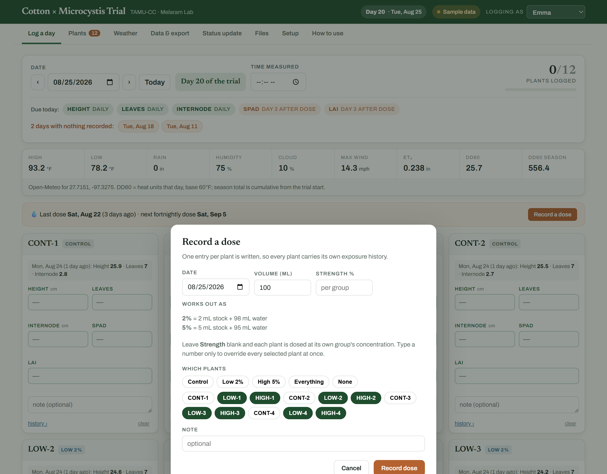
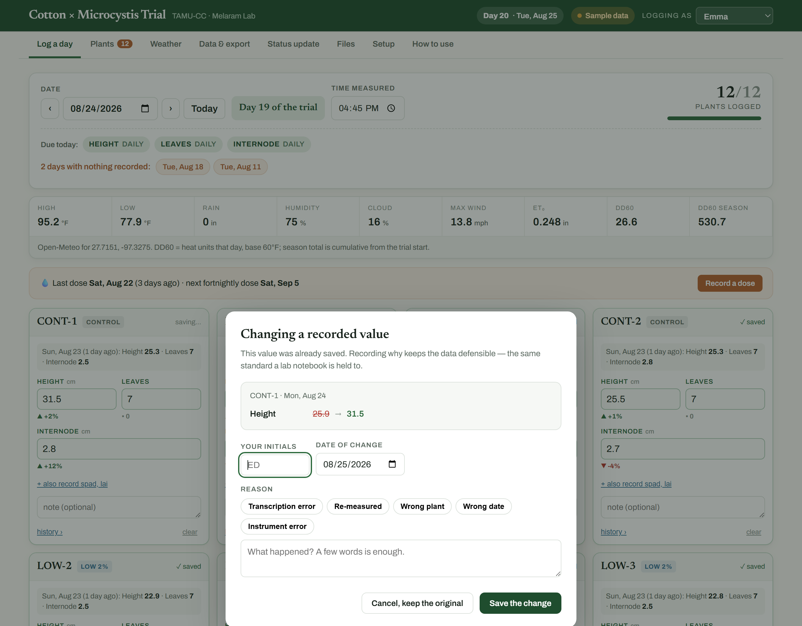
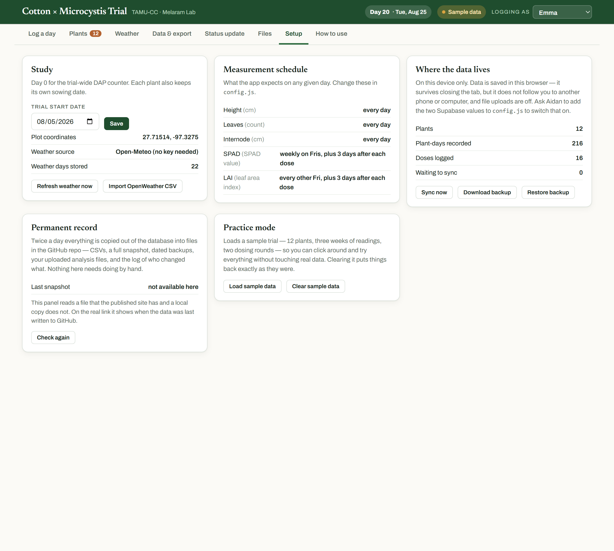

# Cotton Field Log — the complete guide

Hi Emma. This replaces the spreadsheet, the R scripts and the macro button. There is
nothing to install and nothing to code. You open a link, type numbers, and the Excel file
is one click away whenever you or a mentor wants it.

📄 **[Download this guide as a PDF](Cotton-Field-Log-Guide.pdf)** — print it, or keep it on your phone.

**Everything below is shown with the built-in sample trial.** Load it yourself —
**Setup → Load sample data** — and click around freely. Clearing it puts your real data
back exactly as it was, so there is nothing you can break by exploring.

---

## The 60-second version

1. Open the link. Check **Logging as** (top right) says your name.
2. Type each plant's numbers on the **Log a day** tab. It saves itself.
3. On dosing days, press **Record a dose**.
4. When someone wants the data: **Data & export → Download Excel**.
5. When someone wants an update: **Status update → Copy to clipboard**.

Everything else in this guide is detail you can come back to.

---

## 1. Reading the top bar


| | |
|---|---|
| **Day 20 · Tue, Aug 25** | How many days into the trial today is |
| **Saved & synced** | Everything you typed has reached the database. See [section 12](#12-if-something-looks-wrong) for the other things this can say |
| **Logging as** | Your name goes onto every reading you record. Check it before you start |

The tabs across the top are the eight places anything happens. They are covered in order
below.

---

## 2. First time only — add your plants

Go to **Plants**.


**Add one plant** with the label you wrote on the pot, its treatment group, when it was
sown, how deep, and how many seeds.

**Add a full set** is faster when they all start together: fill in the shared details,
type a prefix in **Label**, press **Add a full set…**, and say how many. It creates
numbered plants split evenly across Control, Low 2% and High 5%.

Each plant tile then shows its age, container, sowing depth, how many doses it has had,
its total readings, and its last reading.

- **Edit** — rename, change treatment, change notes
- **Retire** — for a plant that dies or leaves the trial. Its history is kept in full,
  it just stops appearing on the daily list. You can un-retire it

Adding a plant mid-trial is fine. So is retiring one.

---

## 3. The daily routine

Everything on the **Log a day** tab, top to bottom.

### The date row
The date is already today. The arrows step one day at a time, **Today** jumps back.
Backfilling an earlier day is completely normal — just pick the date.

**Time measured** is when you took the readings, not when you typed them.

**12/12 plants logged** tracks the day's progress.

### Due today
The green band says what the schedule expects:

| Measurement | When |
|---|---|
| Height, leaves, internode | Every day |
| SPAD | Weekly, Fridays |
| Ceptometer (LAI) | Every other Friday |
| SPAD and LAI again | 3 days after any dose |

You never have to work the post-dose timing out yourself — the band says
`DAY 3 AFTER DOSE` in orange when it applies. Boxes that are due are outlined in green.

### Days with nothing recorded
Orange chips list days you missed. Tap one to jump straight there and fill it in.

### The weather strip
Filled in for you from the plot's coordinates — you never fetch this.

**DD60** is the heat units for that day; **DD60 SEASON** is the running total since the
trial started. Cotton development tracks heat units better than calendar days, which is
why it is there.

### The plant cards
The grey line on each card is what that plant looked like last time, so you always know
what you are comparing against.

Type the numbers. **There is no save button** — about a second after you stop typing the
card turns green and says ✓ saved.

Under each box is a small arrow comparing what you just typed against that plant's last
reading of the same thing: green up, red down. A red arrow is not an error. It is the
plant telling you something.

Three time-savers:
- **Enter** jumps to the same box on the next plant, so you can go down the bench without
  touching the mouse
- **+ also record** reveals measurements that are not due today, if you took them anyway
- **history ›** opens that plant's full record

### Two rules that matter for the analysis

**Blank is not zero.** An empty box means you did not measure it. A zero means you
measured and it was zero. Statistics treat those completely differently, so please leave
things blank rather than typing 0.

**Leaves is a total count** — how many are on the plant right now, not how many are new.
If it drops from 6 to 4 because two fell off, put 4. That fall is exactly the signal this
trial is looking for.

### The day note
At the bottom: one note for the whole day. Watering, dosing, weather you saw, anything
odd. This is where "the AC in the greenhouse failed overnight" belongs.

---

## 4. Dosing days

Press **Record a dose** in the orange strip.



Pick the date, then the plants — **clicking a group name selects that whole group**.
Controls are left out by default.

Leave **Strength** blank and each plant is dosed at its own group's concentration. The
panel spells out the actual mixture so you can make it up correctly:

```
2% = 2 mL stock + 98 mL water
5% = 5 mL stock + 95 mL water
```

Type a number in **Strength** only if you want to override every selected plant at once.

One record is written per plant, so each plant carries its own exposure history. From
then on the app knows when the 3-day post-dose readings are due, every chart marks the
dose day with a dashed line, and the strip tells you when the next fortnightly dose falls.

---

## 5. Correcting something already saved

Type over a value, or press **clear** to remove a reading entirely.

If that value had already been committed — you saved it on an earlier visit, or someone
else recorded it — this appears first:



| | |
|---|---|
| **Your initials** | Remembered after the first time |
| **Date of change** | Defaults to today |
| **Reason** | Tap a common one, or type your own |

It shows exactly what is about to change, and **nothing is saved until it is filled in**.
**Cancel, keep the original** puts the value back.

Correcting something you typed a minute ago does *not* ask — that is just finishing your
entry. It only asks once a reading has settled, and once a reading has been formally
corrected it asks every time after that.

Why it matters: every number in your dataset either came straight off the instrument, or
has your initials and a reason next to it explaining why it differs. If a committee asks
"why is this point different from your raw sheet", the answer is in the file. The original
value is never deleted.

Corrections appear on the plant's own page, on the **Corrections** sheet of the Excel
export, and in the permanent record.

---

## 6. One plant at a time

Click any plant's name, anywhere.


You get its sowing details, its latest value for everything with the change since the
reading before, a growth curve per measurement with dose days marked, every reading it
has ever had with up/down arrows, and — if there are any — its corrections.

This is the screen to open when someone asks "how is the high-dose group doing", or when
you want to see whether a plant turned the corner after an exposure.

---

## 7. Weather


Conditions at the plot for the whole trial: temperature, rainfall, humidity and cloud,
and cumulative heat units. Filter by date, and export just the weather to Excel or CSV.

You never have to fetch this — it updates itself. **Refresh weather** only forces it. New
days appear about a day late, which is normal for reanalysis data.

---

## 8. Data & export


The **Rows** dropdown switches what you are looking at:

| View | One row per |
|---|---|
| **Plant per day** | Every individual reading — the raw data |
| **Day** | Whole-trial summary per day: means, standard deviations, counts |
| **Treatment per day** | Each group's mean and sd per day — the view to run stats from |
| **Dosing log** | Every exposure |

Narrow it by date range, single plant, or treatment group. **CSV of this view** downloads
exactly what is on screen.

**Download Excel** gives you one workbook with everything:

| Sheet | What's on it |
|---|---|
| **Growth** | One row per plant per day, with change columns and that day's weather attached |
| **Daily** | Whole-trial summary per day |
| **Treatment means** | Per group per day — mean, sd, n |
| **Doses** | Every exposure: which plant, what strength, how much |
| **Corrections** | Every value changed after it was recorded, with initials and reason |
| **Weather** | Daily conditions and heat units |
| **Plants** | Your plant list with treatments and sowing details |
| **Data dictionary** | What every column means, in plain English |

Because the weather is already on every growth row, there is no lining-up by hand and no
VLOOKUP to write.

---

## 9. Status update


Pick a window — **last 7 days**, **last 30 days**, **whole trial**, or custom — and the
summary rewrites instantly:

```
  High 5% — 4 plants
      Height:    21.8 cm     +3.6 (+20%)
      Leaves:    6.5         +0.8
      SPAD:      39.7        +1.3 (+3%)      last read Aug 21
```

Then coverage, dosing, the weather, anything heading the wrong way, and your field notes.
**Copy to clipboard** and paste it into an email.

A measurement that is not taken daily still shows its current value with the date it was
last read, so a 7-day report is not full of blanks. And a 30-day window on a 20-day trial
says so rather than pretending.

**Report by** switches between treatment groups and every plant individually.

---

## 10. Files — your working analysis

Drop your analysis workbook here whenever you update it. Anyone with the link can then see
the live data *and* download your latest analysis, without you emailing anything.
Protocols and photos are welcome too.

Label each upload (working file / protocol / photo / other) and add a note like
"week 3, updated ANOVA".

**Nothing is ever overwritten.** Every upload is kept and tagged with your name and date,
and the newest working file is marked `latest` so nobody grabs a stale one. All of them
are copied into the permanent record twice a day.

---

## 11. Setup



Four panels. You will rarely need any of them, but here is what they do.

**Study** — the trial start date, the plot coordinates, and buttons to refresh the weather
or import a weather file from the old R pipeline.

**Measurement schedule** — what the app expects and when. Changing it is a config edit,
so ask Aidan.

**Where the data lives** — how many plants, readings and doses exist, and how many changes
are waiting to sync. Also:
- **Sync now** — push anything waiting, when you have signal
- **Download backup** — saves the entire season to one file you can email
- **Restore backup** — loads one back in

**Permanent record** — when your data was last written to permanent files, how many
changes have been logged, how many backups are kept, and who has been active this week.
If that line turns red, the automatic backup has stopped — tell Aidan. It does not mean
anything is lost.

**Practice mode** — loads a full sample trial to click around in. Clearing it restores
your real data untouched.

---

## 12. If something looks wrong

**The pill at the top right** tells you the state of your data:

| It says | Meaning |
|---|---|
| **Saved & synced** | Everything has reached the database. Normal |
| **Offline — saved here** | No signal. Your typing is safe on this device and will sync automatically |
| **N waiting** | That many changes still to send. Open the app on wifi, or press **Sync now** |
| **On this device** | Not connected to the shared database at all — tell Aidan |
| **Sample data** | You are in practice mode. Nothing you type is real |

**It works without signal.** Anything typed in the greenhouse is held on the phone and
syncs the moment you have bars again. Just do not clear your browser data while something
is waiting.

**Nothing is deleted by accident.** The only removal is the `clear` link on a single card,
and it asks for a reason first.

**If a number looks wrong**, there is a record of what it was before and who changed it.

**If you are stuck**, press **Setup → Download backup**, email that file to Aidan, and say
what looked wrong. You cannot break this by clicking around.

---

## 13. Where your data actually lives

You do not have to do anything for this, but it is worth knowing.

Everything you type goes into a shared database immediately, which is why it appears on
every device. Twice a day, all of it is also written into permanent files on GitHub:
spreadsheets of every reading, dated backups, your uploaded analysis files, and a log of
every change with who made it and when.

Practically: you cannot lose this data by dropping your phone.

---

## The one habit that matters

Log every day you visit, even if it is a short visit and even if half the boxes are blank.
Consistency is what makes the trends real. The orange "nothing recorded" chips exist to
make catching up easy, not to nag you.
